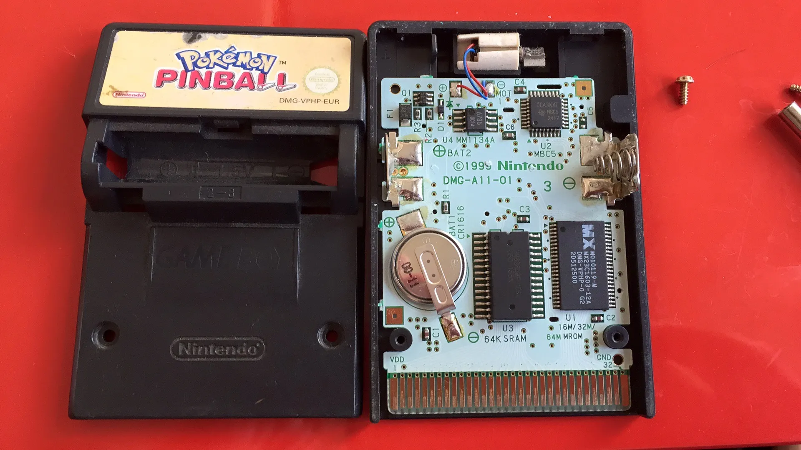

# *Pokémon Pinball* but you can rumble whatever you want

*Pokémon Pinball* is a game for the Game Boy Color that was released in 1999. It's notable for coming in a cartridge format that Nintendo called the "Game Boy Rumble Pak," meaning it's a Game Boy cartridge with a vibrator motor built in.

 
<small>Image taken from Louis Zezeran's blog, [*Honkey Kong Country*](https://www.honkeykongcountry.ee/2016/07/25/the-inside-of-a-game-boy-color-pokemon-pinball-cart/)</small>

Something I've wanted to do for a long time is make something like the [*Rez* trance vibrator](https://www.giantbomb.com/trance-vibrator/3000-6/) but for *Pokémon Pinball*, on a real Game Boy, and without altering/damaging an original cartridge. This required both a ROM hack and a custom link cable peripheral.

## Modding the game
The game mods are contained in the [`pokepinball-romhack` repo](https://github.com/heyspacebuck/pokepinball-romhack), which is included as a submodule of this repo. Using the reverse-engineered code from [PRET](https://github.com/pret/pokepinball), I tracked down any time the built-in rumble was triggered and added some lines that spit a data byte out of the serial port.

The ROM hack is available as [an .ips patch](pokepinball-serial.ips) here in this repo. Use a patching tool like <a href="https://www.romhacking.net/utilities/240/" target="_blank">Lunar IPS</a> to apply the patch to the ROM `Pokemon Pinball (U) [C][!].gb` with hash `sha1: 9402014d14969432142abfde728c6f1a10ee4dac`.

To play this ROM hack on an actual Game Boy, I got a cheap repro cart from AliExpress (it was sold as *Pokémon Battle Factory* and had a Charizard on the cover) and overwrote it using a [GBxCart RW v1.4 Pro](https://www.gbxcart.com/). I had never done this before; I had [this blog post by JinGen Lim](https://jg.sn.sg/ir/) to guide me on what to buy.

It would be nice to transmit more than a single byte at a time. I don't know how to shoehorn that in to the existing ROM; I'd have to study quite a bit to get to that point. If you have suggestions, let me know!

## Peripheral part 1: reading the data off the serial port
When the cartridge starts a serial port transmission, a few things happen:

* The `SC` (Serial Clock) signal starts wiggling at 8 kHz
* The cartridge sends out data to be read on the rising clock edge

8 kHz is a nice and slow clock, easy to work with. In the repo are two example projects—[one for the Arduino](/peripheral-arduino/) and [one for the ATtiny85 using ATtinyCore](/peripheral-attiny85/). Both set up a pin-change interrupt that fires whenever the `SC` signal goes from LOW to HIGH. At that point it reads the data bit that is coming in and processes it, which leads to the next step, described below.

## Peripheral part 2: doing something with that data
The microcontroller has received a byte from the cartridge, now what? It depends on the nature of the device you want to control. In [the example Arduino sketch](/peripheral-arduino/), no device is controlled, it just sends a message to the Serial Monitor with the details of the signal received. In [the example ATtiny85 sketch](/peripheral-attiny85/), the microcontroller puts out a PWM signal to drive a high-side P-channel MOSFET switch. If I had a larger device to drive (like, say, a Hitachi Magic Wand), I'd need some different control circuitry. So, this part is still uncertain and open to suggestions!